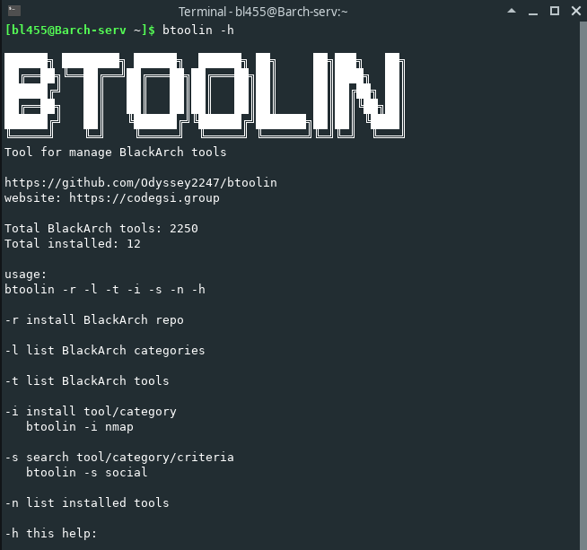

    ██████╗ ████████╗ ██████╗  ██████╗ ██╗     ██╗███╗   ██╗
    ██╔══██╗╚══██╔══╝██╔═══██╗██╔═══██╗██║     ██║████╗  ██║
    ██████╔╝   ██║   ██║   ██║██║   ██║██║     ██║██╔██╗ ██║
    ██╔══██╗   ██║   ██║   ██║██║   ██║██║     ██║██║╚██╗██║
    ██████╔╝   ██║   ╚██████╔╝╚██████╔╝███████╗██║██║ ╚████║
    ╚═════╝    ╚═╝    ╚═════╝  ╚═════╝ ╚══════╝╚═╝╚═╝  ╚═══╝
    Tool for manage BlackArch tools

    https://github.com/joselbr2099/btoolin
    website: https://reset2099.com/

Script to install and manage blackarch tools in any distribution based on Arch linux

FEATURES
- Install the blackarch repository
- Install / uninstall blackarch tools
- List the categories of tools present in blackarch
- Search tools / categories / criteria to find matches
- Install repo in any distro based on arch linux

INSTALLATION:

    chmod + x btoolin
    cp btoolin ~ /.local/bin   //make sure yo have ~/.local/bin in your PATH

RUN

    btoolin -h

